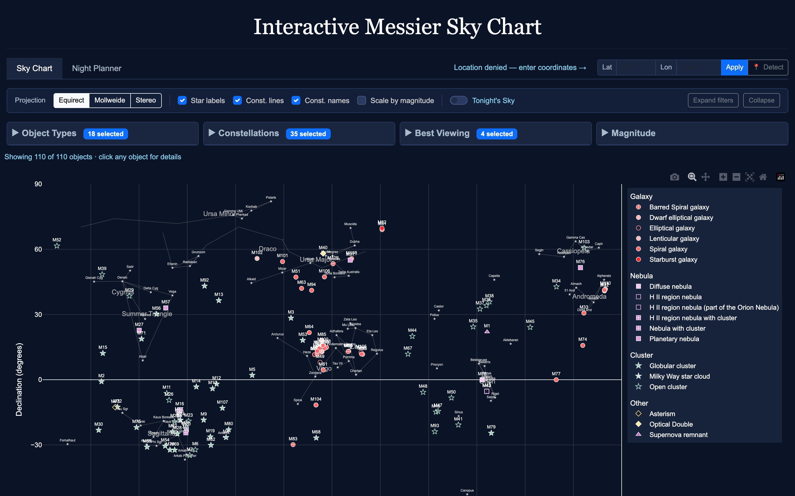
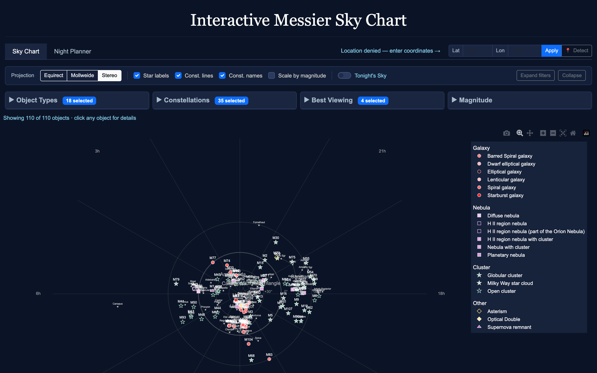
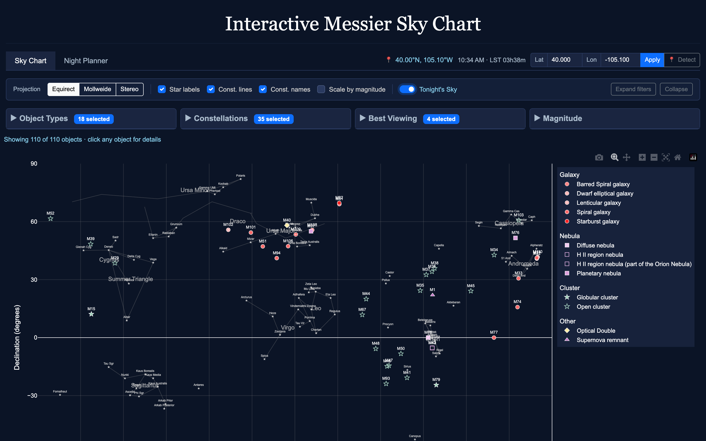
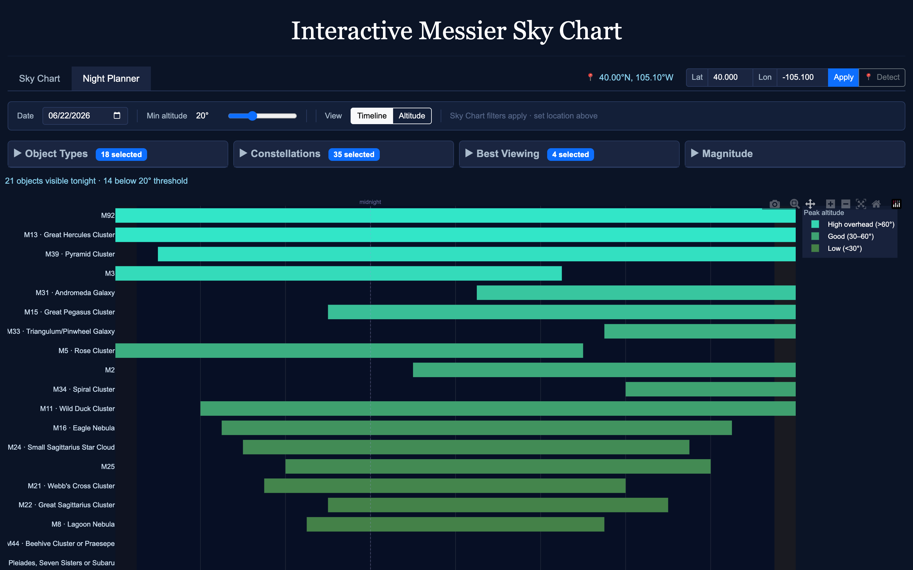
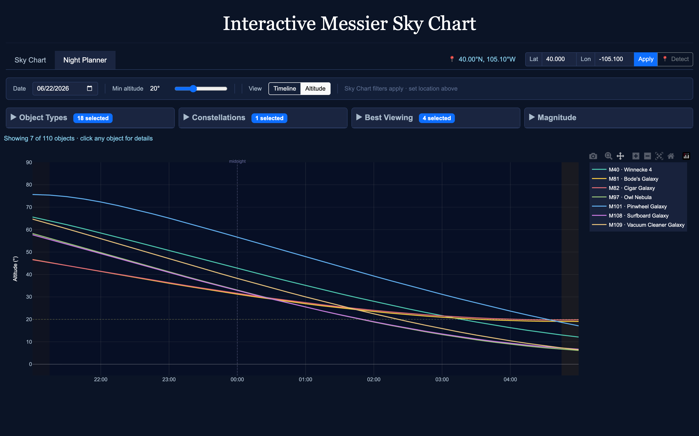
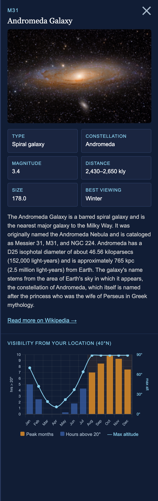

# Messier Explorer

An interactive web app for exploring all 110 Messier deep-sky objects — on an accurate sky chart, and as a night-by-night observation planner.

**Try it live:** https://bbrannon4.github.io/messier-explorer/



---

## How to Use

### 1. Explore the sky chart

The home view plots all 110 Messier objects by right ascension and declination, over 15+ major constellations with their bright stars labeled. Marker shape and color show the object type (galaxy, nebula, cluster…) — see the legend on the right.

- **Hover** any object for its name, type, magnitude, distance, and coordinates.
- **Click** an object to open its full detail panel (see step 5).
- Use the **toggles** along the top bar to show or hide star labels, constellation lines, and constellation names, or to **scale markers by magnitude** so brighter objects appear larger.

### 2. Narrow down what you see

Open the filter cards — **Object Types**, **Constellations**, **Best Viewing** (season), and **Magnitude** — to focus the chart on what you care about. Every filter you set here also carries over into the Night Planner, so you can build a target list once and use it everywhere. The count below the toolbar tells you how many of the 110 objects are currently shown.

### 3. Switch projections

Use the **Projection** buttons to change how the sky is mapped:

- **Equirect** — a simple RA/Dec grid (the default).
- **Mollweide** — an equal-area ellipse showing the whole sky.
- **Stereo** — a north-polar planisphere, the way a star wheel looks.



### 4. See what's up tonight

Flip on **Tonight's Sky** and set your location (the app will try to detect it, or you can type a latitude/longitude into the bar at the top). The chart then shows **only the objects currently above your horizon**, so you can tell at a glance what's actually observable right now.



### 5. Plan a whole night

Switch to the **Night Planner** tab to plan a full evening of observing. It uses your location and the date you pick, and respects the filters from the sky chart.

**Timeline view** lays out each object's visibility window across the night as a horizontal bar — when it clears your minimum altitude and when it drops back below. Bars are colored by peak altitude (how high it gets), and the background is shaded for twilight and full dark. Great for sequencing a session top to bottom.



**Altitude view** plots altitude over time for your filtered objects, so you can see exactly when each one rides highest. Best with a handful of targets. Click any line to open that object's details.



> **Tip:** drag the **Min altitude** slider to set your horizon cutoff (trees, buildings, atmospheric murk). Objects that never clear it for the night drop out of both planner views.

### 6. Dig into a single object

Click any object — on the sky chart, the Timeline, or an Altitude curve — to open its detail panel: a photo, description, and key stats pulled from Wikipedia, plus a **monthly visibility chart** for your location. The bars show how many hours per month the object sits above 20° during astronomical dark, the line tracks its highest altitude, and the **best months are highlighted** — so you know not just *if* you can see it, but *when it's worth waiting for*.



---

## Running Locally

The app loads its catalog with `fetch()`, which browsers block on `file://`, so it needs to be served over HTTP. From the project folder:

```bash
python -m http.server 8080
```

Then open http://localhost:8080. (Any static file server works.)

## Data

`Messier_data.csv` contains all 110 Messier objects with coordinates, magnitudes, distances, types, and best viewing seasons.

## Hosting

Served via GitHub Pages from the `main` branch. A `.nojekyll` file disables Jekyll processing since this is a plain static site. Pushes to `main` deploy automatically.

## License

MIT — see LICENSE file for details.
